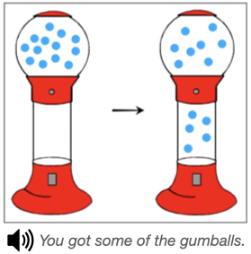
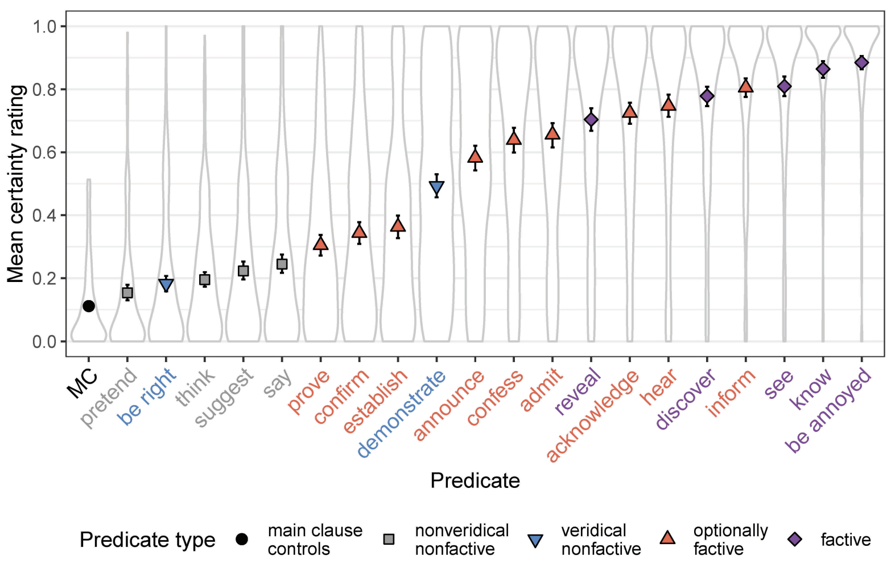
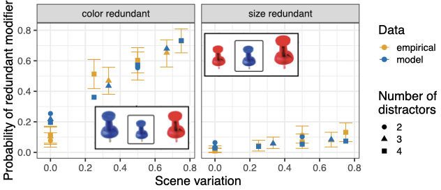
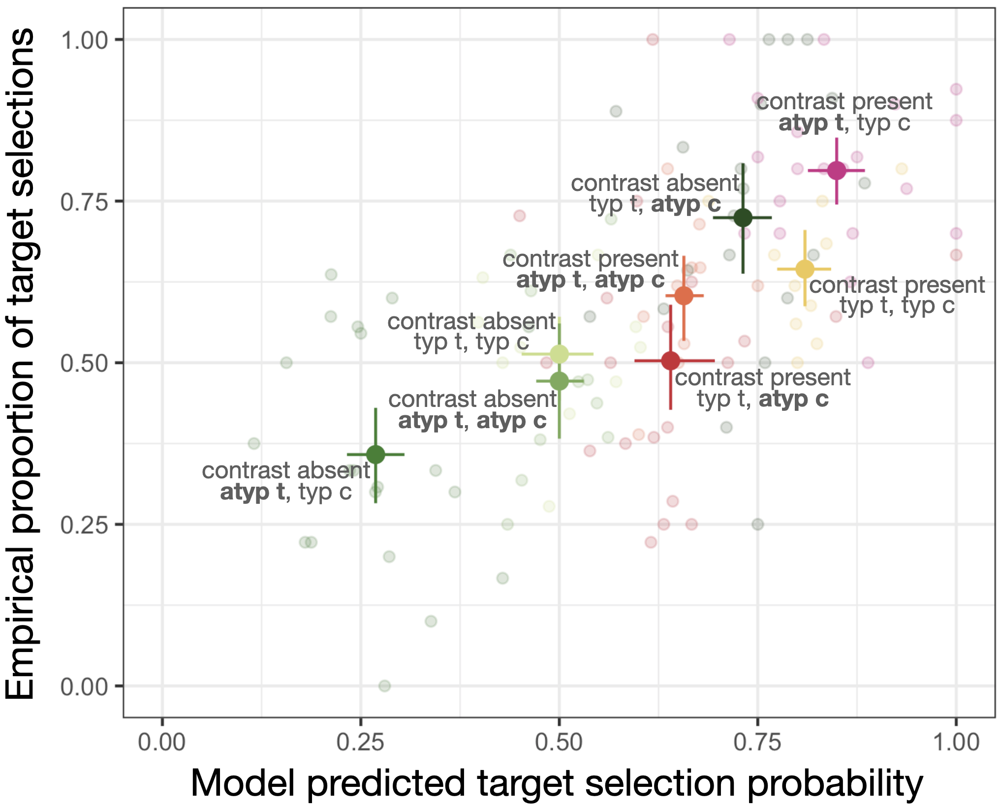
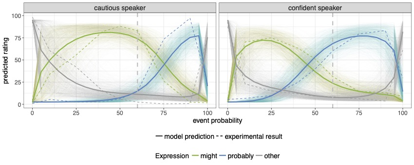
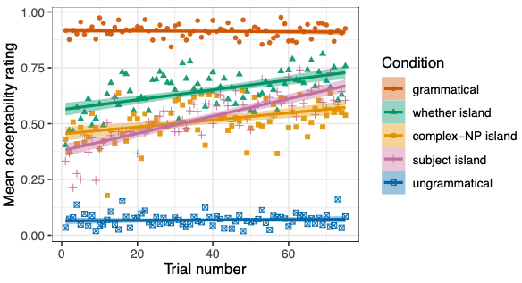
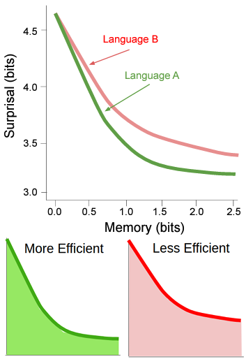
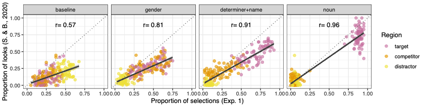

# Implicature and pragmatic inference

We take a strongly contextualist approach to pragmatics and have found it useful to implement hypotheses about the interaction of literal meaning, world knowledge, and context in Bayesian or other probabilistic pragmatics frameworks, like the Rational Speech Act framework ([Degen 2023](https://alpslab.stanford.edu/publications.html#2023Degen)).

### Scalar inferences

Using a combination of experimental methods, corpus analyses, and Bayesian computational modeling, we find that scalar inferences (i.e., interpreting a sentence like "Alex ate some of the cookies" to mean they didn't eat all of them) are strongly context-dependent. 

The **probability** of deriving a scalar inference is modulated by:
- lexical, syntactic, and discourse features of the linguistic context ([Degen 2015](https://alpslab.stanford.edu/publications.html#2015Degen)), which neural language models based on contextual word embeddings can learn from data and use to predict inference strength judgments ([Schuster et al. 2020](https://alpslab.stanford.edu/publications.html#2020SchusterChenEtAl), [Li et al. 2021](https://alpslab.stanford.edu/publications.html#2021LiSchusterEtAl));
- the presence of alternatives ([Degen & Tanenhaus 2015](https://alpslab.stanford.edu/publications.html#2015DegenTanenhaus), [Waldon & Degen 2020b](https://alpslab.stanford.edu/publications.html#2020WaldonDegenB));
- the Question Under Discussion (QUD, [Degen & Goodman 2014](https://alpslab.stanford.edu/publications.html#2014DegenGoodman), [Kursat & Degen 2020](https://alpslab.stanford.edu/publications.html#2020KursatDegen));
- prior beliefs about the probability of the stronger alternative being true ([Degen et al. 2015](https://alpslab.stanford.edu/publications.html#2015DegenTesslerEtAl)).

We find that while we sometimes replicate that scalar inferences incur a processing cost, the **speed** with which scalar inferences are processed is modulated by:
- the presence of alternatives in a visual world eye-tracking paradigm ([Degen & Tanenhaus 2016](https://alpslab.stanford.edu/publications.html#2016DegenTanenhaus));
- the QUD in a truth-value judgment paradigm ([Kursat & Degen 2020](https://alpslab.stanford.edu/publications.html#2020KursatDegen)). In this paper, we also find that literal responses are slower than pragmatic responses when produced by participants who have an overall preference to respond pragmatically. 

This body of work has led us to propose a **constraint-based account** of scalar inferences, under which the probability of deriving the inference and the speed with which it is processed are a function of the contextual support the inference receives ([Degen & Tanenhaus 2015](https://alpslab.stanford.edu/publications.html#2015DegenTanenhaus), [2019](https://alpslab.stanford.edu/publications.html#2019DegenTanenhaus)). In numerous places, we have used the **Rational Speech Act (RSA) framework** to formally implement assumptions of the constraint-based account ([Degen & Goodman 2014](https://alpslab.stanford.edu/publications.html#2014DegenGoodman), [Degen et al. 2015](https://alpslab.stanford.edu/publications.html#2015DegenTesslerEtAl), [Waldon & Degen 2020b](https://alpslab.stanford.edu/publications.html#2020WaldonDegenB)). 

An important component of constraint-based and RSA accounts of scalar inferences is that listeners are assumed to reason about how likely a speaker would have been to produce the weaker and stronger alternative. We recently used neural language models to approximate human predictive distributions, finding that SI rates both within scales and across scales are captured by the expectedness of the stronger alternative ([Hu et al. 2023](https://alpslab.stanford.edu/publications.html#HuEtAl2023)). Crucially, however, expectedness robustly predicts cross-scale variation only under a meaning-based computation of alternatives. Our results suggest that pragmatic inferences arise as the result of listeners' context-driven and meaning-based production expectations over alternatives.

See [Linking functions](#linking-functions) section below for additional insights. 

*Note: Judith Degen's dissertation (Degen 2013) already contains much of the work and/or ideas reported in Degen 2015, Degen & Tanenhaus 2015/2016, and Kursat & Degen 2020. Degen & Tanenhaus 2011 is superseded by Degen & Tanenhaus 2015 and Degen & Tanenhaus 2016.*

### Projection inferences

In a long-standing collaboration with [Judith Tonhauser](https://judith-tonhauser.github.io/), we investigate the interplay of lexical meaning, context, and world knowledge in the computation of projection inferences (e.g., the inference that Alex is committed to Julian dancing salsa if they ask a polar interrogative like "Does Sam know that Julian dances salsa?"). We have found that projection varies as a function of the QUD ([Tonhauser et al. 2018](https://alpslab.stanford.edu/publications.html#2018TonhauserBeaverEtAl), [2020](https://alpslab.stanford.edu/publications.html#2020TonhauserDeMarneffeEtAl)) and prior beliefs about truth of content ([Degen & Tonhauser 2021](https://alpslab.stanford.edu/publications.html#2021DegenTonhauser)). One main finding for clause-embedding predicates in particular has been that neither projection nor projection and entailment (two standard diagnostics of factivity) categorically distinguish factive predicates from others ([Degen & Tonhauser 2022](https://alpslab.stanford.edu/publications.html#DegenTonhauser2022B)). We are currently in the process of developing an account of projection couched in the Rational Speech Act framework, a very first step towards which can be found in [Pan & Degen 2023](https://alpslab.stanford.edu/publications.html#2023PanDegen). 

# Reference

What determines the choice of definite referring expression from among many possible alternatives (e.g., "the car", "the red car", "the big red car") in production, and what are the predictive referential inferences that listeners derive from the observation of partial such expressions (e.g., "the big...") in interpretation? 

### Production of referring expressions

When a property is contextually redundant for establishing reference (e.g., "red" in a context where a target object is big and red, and there are other red but no other big objects), we replicate for English the result that participants are more likely to redundantly mention color than size or material, that redundant modifier use is more likely in more visually variable scenes, and that atypical object colors are more likely to be mentioned redundantly ([Degen et al. 2020](https://alpslab.stanford.edu/publications.html#2020DegenHawkinsEtAl)). 

To explain all of these effects jointly, we propose a Bayesian account of referring expression production that assumes that speakers rationally trade off the contextual informativeness and the cost of referring expressions ([Degen et al. 2020](https://alpslab.stanford.edu/publications.html#2020DegenHawkinsEtAl)). Crucially, we assume that the computation of contextual informativeness is based on continuous semantic values rather than standard Boolean truth conditions, which allows for capturing the intuition that colors are (ceteris paribus) more reliable for communication than size. Preliminary evidence shows that this notion of reliability is at least partly the result of the difficulty associated with establishing whether a property holds of an object ([Kursat & Degen 2021](https://alpslab.stanford.edu/publications.html#2021KursatDegen)). We have recently extended the account to allow for incremental (word-by-word) computation of utterance utility ([Waldon & Degen 2021](https://alpslab.stanford.edu/publications.html#2021WaldonDegen)). However, we have so far only found limited cross-linguistic evidence for the role of incrementality. For instance, we replicate the standard color/size asymmetry in redundant modification in CTSL, an emerging village sign language in Turkey ([Kursat et al. 2022](https://alpslab.stanford.edu/publications.html#2022KursatWaldonEtAl)). In ongoing work we find somewhat less redundant modification in English and French than in Spanish, with most effects still explained by the continuous semantics ([Waldon et al. in prep](https://alpslab.stanford.edu/publications.html)). Important future directions include rigorous model comparison between implementations of different notions of incrementality, fueled by cross-linguistic data from languages with different syntactic properties than English, and which require different amounts of lookahead in noun phrase planning.

*Note: Graf et al. 2016 is supserseded by Degen et al. 2020.*

### Interpretation of partial referring expressions

Instructions with partial referring expressions, as in "Click on the red..." have been shown to give rise to contrastive inferences, a type of predictive pragmatic inference whereby the listener infers that the likely target referent is one that shares its type with another (non-red) object. We find that listeners derive contrastive inferences in the color domain to varying degrees, and they do so more readily, the more the use of the color term can only be ascribed to there being a color contrast between objects of the same type. We provide an RSA account of this interpretive variability that highlights the importance of listeners reasoning about a generative speaker model incrementally ([Kreiss & Degen 2020](https://alpslab.stanford.edu/publications.html#2020KreissDegen), [Kreiss & Degen in prep.](https://alpslab.stanford.edu/publications.html)). Future directions include testing the account on domains other than color, and documenting predictive pragmatic inferences in languages with different syntactic properties than English.

# Adaptation and variability

A crucial component common to the interpretation accounts applied to the phenomena described above is that listeners make use of a generative model of the speaker -- how likely would a speaker have been to produce utterance *u* (compared to alternatives) if they had intended to communicate meaning *m* (compared to alternatives)? In order to build such a generative model, listeners must track and adapt to the statistics of the input -- that is, what the form-to-meaning mappings are that speakers generally assume, as well as any speaker-specific idiosyncracies that might be general enough to have predictive value in online processing or interpretation. Which aspects of the statistics of the input do listeners track, and what are the consequences for processing and interpretation?

### Semantic/pragmatic adaptation and variability

We show that listeners update the space of meanings they expect to be covered by certain expression in response to exposure to speakers who use these expressions differently: The quantities that listeners take a speaker to describe using the quantifiers "some" and "many" change in response to exposure, and do so speaker-specifically ([Yildirim et al. 2016](https://alpslab.stanford.edu/publications.html#2016YildirimDegenEtAl)). Similarly for the uncertainty expressions "might" and "probably" (though the amount of speaker-specificity is limited, [Schuster & Degen 2019](https://alpslab.stanford.edu/publications.html#2019SchusterDegen)). We develop an RSA account that simulates adaptation and find, conditioning on the experimental data,  that listeners update both the lexicon (capturing form-meaning mappings) and utterance costs (capturing speaker-specific utterance preferences, [Schuster & Degen 2020](https://alpslab.stanford.edu/publications.html#2020SchusterDegen)). We also find in the domain of scalar implicatures that shifted interpretation after exposure to speakers who use varying more complex alternatives can be accounted for with updates to a lexical uncertainty model ([Waldon & Degen 2020b](https://alpslab.stanford.edu/publications.html#2020WaldonDegenB)).

In the nominal domain, we find interpretive variability for edge cases of artifact nouns (e.g., whether bikes are covered by rules such as "No vehicles in the park"), and that this variability is modulated by evidence about the purpose of the rule (e.g., to avoid pollution). We develop a probabilistic, goal-based account of the extension resolution procedure for artifact nouns (Waldon et al. under review). In other work on the interpretation of edge cases in contractual language, we find that interpreters routinely underestimate interpretive variability, thus demonstrating a clear false consensus bias ([Waldon et al. 2023](https://alpslab.stanford.edu/publications.html#2023WaldonEtAl)). 

Future directions include accounting for the tension between interpreters' remarkable ability to track and adapt to the statistics of the input while simultaneously underestimating interpretive variability. This may be partly due to individual differences between participants. For instance, we have shown that participants differ in the depth to which they reason pragmatically in both production and comprehension ([Franke & Degen 2016](https://alpslab.stanford.edu/publications.html#2016FrankeDegen)).

*Note: Yildirim et al. 2013 is superseded by Yildirim et al. 2016.*

### Syntactic adaptation

Syntactically degraded sentences (e.g., "Who does Alex wonder whether Sam likes?") mysteriously become more acceptable with repeated exposure, a phenomenon called 'satiation.' We show in a meta-analysis of studies targeting satiation that there is indeed overwhelming evidence for satiation across many types of sentences that are taken to violate island constraints ([Lu et al. under review](https://alpslab.stanford.edu/publications.html#LuEtAl_submitted)). We show that satiation of such sentence types is speaker-specific ([Lu et al. 2021](https://alpslab.stanford.edu/publications.html#2021LuLassiterEtAl)) and that exposure to one type of island violation can lead to the satiation of another island type, suggesting that comprehenders track both island type-general and island type-specific representations ([Lu et al. 2022](https://alpslab.stanford.edu/publications.html#2022LuWrightEtAl)). Overall, this work supports a view of satiation as adaptation: comprehenders track and update their beliefs about the probability of observing certain sentences or sentence types. The more expected a sentence (type) is, the  more acceptable it is taken to be. Future directions include characterizing the interplay between grammar and contextual pragmatic utterance expectations to explain (the different rates of) satiation and formulate a more general linking hypothesis for acceptability judgments.

In other work, we show that children also appear to use syntactic adaptation to bootstrap the meanings of novel words ([Swanson et al. under review](https://alpslab.stanford.edu/publications.html#SwansonEtAl_submitted)).

# Ordering phenomena

We proposed processing efficiency and communicative efficiency based accounts of a variety of cross-linguistic ordering phenomena. These include: 

1. **Adjective ordering preferences** ([Scontras et al. 2017](https://alpslab.stanford.edu/publications.html#2017ScontrasDegenEtAl)), where we show that more subjective adjectives occur farther away from the noun they modify. We show that this preference may be due either to a pressure to minimize the propagation of noise during the compositional process ([Scontras et al. 2019](https://alpslab.stanford.edu/publications.html#2019ScontrasDegenEtAl)) or to a pressure to maximize the amount of information communicated under assumptions of memory limitations ([Hahn et al. 2018](https://alpslab.stanford.edu/publications.html#2018HahnDegenEtAl)).
2. **General word and morpheme order preferences** ([Hahn et al. 2021](https://alpslab.stanford.edu/publications.html#2021HahnDegenEtAl), [Hahn et al. 2022](https://alpslab.stanford.edu/publications.html#2022HahnMathewEtAl)), where we find that languages exhibit information locality (high mutual information between neighboring words/morphemes). We show that this is a natural consequence of languages being structured to efficiently manage the *memory-surprisal trade-off*: a certain maximal level of average surprisal per word can only be achieved at the cost of storing some minimal amount of information about the past context. 
3. **The order of nouns and adjectives** ([Yu et al. 2023](https://alpslab.stanford.edu/publications.html#2023YuEtAl)), where we show that the preference for languages to have post-nominal adjectives may be the result of iterated pressures for pragmatic referential communication, under the assumption that production planning proceeds incrementally and adjectives are on average noisier than nouns.

# Communicating (about) uncertainty

Speakers have many ways of indicating their evidence for and (un)certainty about a proposition *p* they assert. How do speakers decide between evidential devices and markers of uncertainty? How do listeners integrate that information? We show that in both English and German, listeners attribute a stronger belief in *p* to speakers than they end up holding themselves, regardless of whether bare utterances (e.g., "It's raining") or alternatives (e.g., "It must be raining," "It's probably raining") are used ([Degen et al. 2019](https://alpslab.stanford.edu/publications.html#2019DegenTrotzkeEtAl)). We develop a hybrid account of the interpretation and use of perception verbs ("The dress looks blue") within the RSA framework that derives estimates of uncertainty about *p* to joint reasoning about evidence directness and alternative utterances ([Fishman & Degen 2023](https://alpslab.stanford.edu/publications.html#2023FishmanDegen)). Future directions include further testing the account, extending it to additional existential devices, and explaining belief asymmetries between listener and speaker.

# Linking functions

Experimental pragmatics (and psycholinguistics more generally) is in dire need of explicit linking functions for all of the most commonly used experimental measures, including truth-value judgments, visual world eye-tracking, acceptability judgments, etc. We believe that providing such linking functions is not a mere methodological task, but contributes to the theoretical understanding of the phenomena under consideration.

1. **Truth-value judgments**: We show that the number of response options given to participants in a truth-value judgment task substantially alters the researcher-side inferences about scalar inference rates ([Jasbi et al. 2019](https://alpslab.stanford.edu/publications.html#2019JasbiWaldonEtAl)). In [Waldon & Degen 2020a](https://alpslab.stanford.edu/publications.html#2020WaldonDegen), we link the probability of a response to an RSA-derived contextual production probability. The more likely the experimentally observed utterance is under the model, the more likely the participant is assumed to provide a "true" response (with a threshold-based generalization to multiple response options).

2. **Visual world eye-tracking** (in referential tasks): We are in the early stages of testing a linking function that we call the 'Referential Belief Link' -- that the proportion of looks to a region in a time window represents participants' (implicit) beliefs that that region is the intended referent. We measure explicit beliefs in published eye-tracking studies using an incremental belief task and ask whether the explicit beliefs are predictive of the published implicit beliefs. We replicate the eye-tracking results of Sun & Breheny 2020 ([Degen et al. 2021](https://alpslab.stanford.edu/publications.html#2021KursatDegenEtAl)) but not of Leffel et al. 2016 ([Qing et al. 2018](https://alpslab.stanford.edu/publications.html#2018QingLassiterEtAl)), and find that for the former but not the latter, explicit beliefs are predictive of implicit beliefs. We also find, using free production studies, that the more participants expect the experimentally observed utterance to be produced by a speaker, the more predictive implicit beliefs are of explicit beliefs ([Degen & Pophristic 2022](https://alpslab.stanford.edu/publications.html#2022DegenPophristic)),  highlighting again the importance of listeners simulating or tracking production expectations in explaining data in experimental pragmatics. Future directions include testing the Referential Belief Link on additional studies -- we are always looking for additional eye-tracking datasets to re-analyze, so do write us if you're interested in contributing yours -- and developing a more general linking function for referential visual world tasks.

